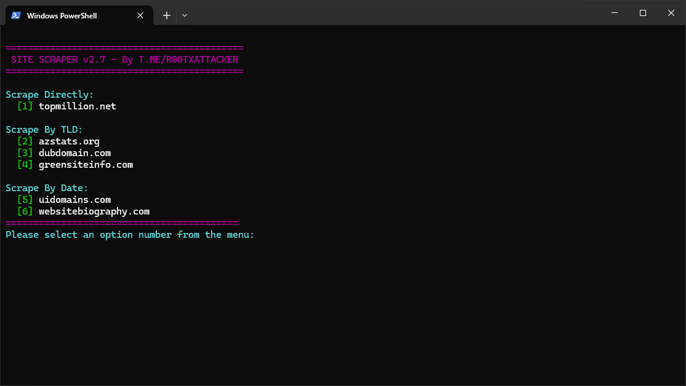

# 🌐 Site Scraper v2.7



A lightweight Python scraper built with [requests](https://docs.python-requests.org/en/latest/) and [colorama](https://pypi.org/project/colorama/).  
It extracts data from websites quickly and efficiently with multi-threading support.

---

## 🚀 Features
- Scrape from **multiple sources**  
  - TLD-based  
  - Date-based  
- **Multi-threaded scraping** for faster performance
- Colorful console output with `colorama`
- Simple single-script setup

---

## 📦 Installation
Clone the repo and install dependencies:

```bash
git clone https://github.com/yourusername/site-scraper.git
cd site-scraper
pip install -r requirements.txt
